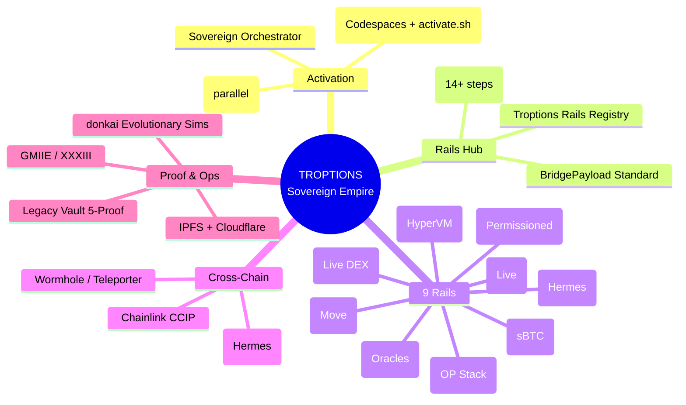
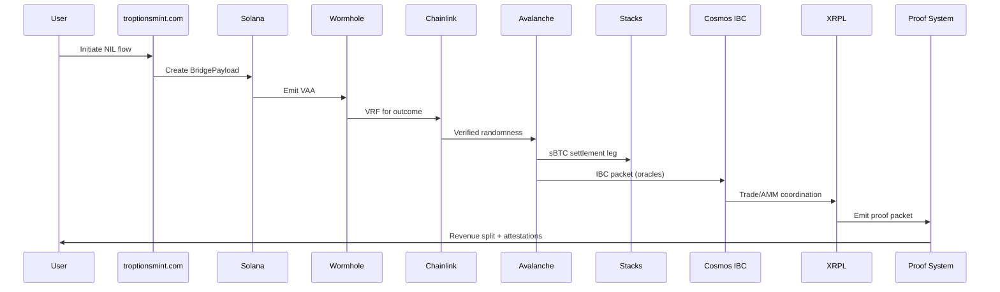
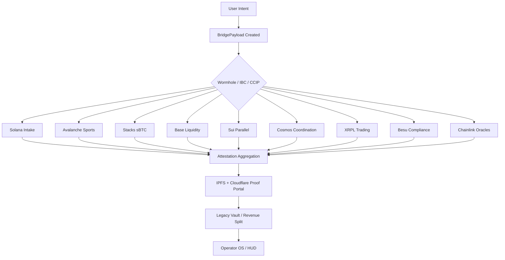
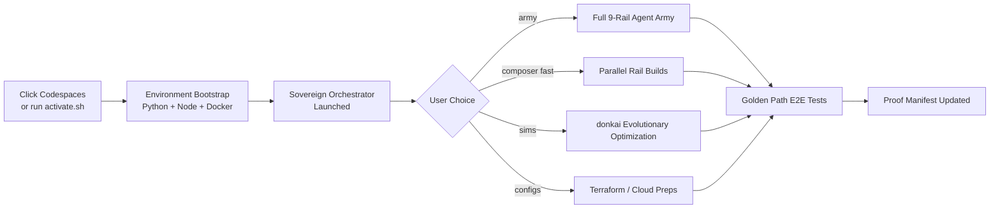

# 🚀 TROPTIONS RAILS

> **Professional multi-chain rail orchestration for the Troptions sovereign ecosystem**

[](https://github.com/codespaces/new?hide_repo_selector=true&ref=main&repo=FTHTrading/troptions-rails)
[](https://opensource.org/licenses/MIT)
[](https://github.com/FTHTrading/troptions-rails)
[](https://github.com/FTHTrading/troptions-rails)
[](https://chain.link/)

---

## 📀 Table of Contents

- [Overview](#overview)
- [How It All Works](#how-it-all-works)
- [Flow Trees & Architecture Diagrams](#flow-trees--architecture-diagrams)
- [The 9 Main Rails (Color-Coded)](#the-9-main-rails-color-coded)
- [1-Click Activation](#1-click-activation)
- [Quick Start](#quick-start)
- [Major Integrations & Tools](#major-integrations--tools)
- [Key Documents & Artifacts](#key-documents--artifacts)
- [Architecture](#architecture)
- [Contributing](#contributing)
- [License](#license)

---

## Overview

**troptions-rails** is the central professional orchestration layer for the Troptions 9-rail multi-chain empire.

It provides:

- Unified **BridgePayload** standard across all chains
- **Golden Path** end-to-end flows (e.g. FIFA NIL sports capital)
- One-command multi-chain activation & testing
- Central **Rails Registry** with activation flags
- Production-grade documentation, proofs, and client onboarding

This repository turns complex cross-chain infrastructure into a clean, color-coded, 1-click experience.

---

## How It All Works

The Troptions system is built as a **sovereign multi-chain empire** with these core principles:

### 1. Unified Data Layer (BridgePayload)
All rails communicate using a single standardized `BridgePayload` structure. This carries:
- Intent (what action: mint, claim, settle, prove)
- Attestations (proofs from oracles, Chainlink VRF, etc.)
- Cross-chain references (tx hashes, VAA, IBC packets)
- Metadata (NIL rights, ticket IDs, revenue splits)

This eliminates per-chain custom glue code.

### 2. Golden Path (End-to-End Flow)
A canonical 14+ step flow (example: FIFA NIL sports capital):

1. User interacts via troptionsmint.com or Operator OS
2. Payload created on Solana (intake)
3. BridgePayload emitted via Wormhole
4. Chainlink VRF provides randomness/sports outcome
5. Avalanche processes high-throughput ticket issuance (HyperSDK)
6. Sui parallel execution for volume
7. Stacks settles sBTC portion (BTC anchor)
8. Base provides liquidity / ERC-4337 onboarding
9. Cosmos IBC Hub coordinates oracles across zones (via Hermes)
10. XRPL handles trading/AMM leg
11. Besu private compliance rail for institutional flows
12. Chainlink CCIP + Automation for keepers and messaging
13. Proofs aggregated (IPFS + Cloudflare + GMIIE/XXXIII)
14. Revenue split to Legacy Vault / operators / talent

The entire path is tested in the E2E Harness (mock + live modes).

### 3. Activation & Orchestration
- **1-Click**: `activate.sh` or GitHub Codespaces spins up the environment.
- **Sovereign Orchestrator** (Python + local LLM): Drives army, sims, configs.
- **Composer Fast**: Parallel agents build/test all 9 rails at once.
- **Rails Registry**: Central JSON/YAML with activation flags per rail.
- **donkai sims**: Evolutionary optimization of tokenomics, bridge fees, and configs across chains.

### 4. Cross-Chain Wiring
- Wormhole + Teleporter: Avalanche ↔ Solana ↔ Base ↔ Stacks
- Hermes IBC: Cosmos Hub as coordination zone for all others
- Chainlink: Universal oracle + messaging layer
- Direct pegs: sBTC on Stacks, TUSD on Base

Everything is attested and proven via the empire-proof-manifest.json.

---

## Flow Trees & Architecture Diagrams

GitHub renders these Mermaid diagrams natively.

### High-Level Empire Architecture (Flow Tree)



### Golden Path Sequence Flow



### BridgePayload Data Flow Tree



### 1-Click Activation Flow



---

## The 9 Main Rails (Color-Coded)

| # | Chain                  | Type                          | Status              | Primary Purpose                          | Key Built Components |
|---|------------------------|-------------------------------|---------------------|------------------------------------------|----------------------|
| 1 | **Solana**            | L1                            | 🟢 Live & Strong   | Intake, minting, troptionsmint.com      | Anchor program, Wormhole VAA, BridgePayload |
| 2 | **Avalanche**         | L1 + HyperVM Subnet           | 🔵 Fully Built      | High-throughput sports execution        | HyperSDK Actions, Teleporter, NILRights |
| 3 | **Stacks**            | Bitcoin L2 (Nakamoto)         | 🔵 Fully Built      | sBTC settlement & BTC anchor            | Clarity contracts, sBTC peg |
| 4 | **Base**              | Ethereum L2 (OP Stack)        | 🔵 Fully Built      | Liquidity + ERC-4337 onboarding         | TroptionsAccount, Paymaster, TUSD |
| 5 | **Sui**               | L1 (Move)                     | 🔵 Fully Built      | Parallel high-volume execution          | Move modules, sports_vrf |
| 6 | **Cosmos IBC Hub**    | IBC Zone                      | 🔵 Built            | Cross-chain interoperability            | IBC skeleton + Hermes relayer |
| 7 | **XRPL**              | L1 (Exchange OS)              | 🟢 Live             | Trading, AMM, proof packets             | Live DEX, issuer tools, gateway |
| 8 | **Hyperledger Besu**  | Permissioned EVM              | 🔵 Built            | Banking, CBDC, compliance               | QBFT, private tx rail |
| 9 | **Chainlink**         | Oracle / Intelligence Layer   | 🟠 Fully Integrated | Intelligence backbone                   | VRF, CCIP, Automation, PoR |

**Legend:** 🟢 = Live Production | 🔵 = Fully Built & Audited | 🟠 = Integrated

All rails are wired into the **Troptions Rails Registry**, **Golden Path** (14+ steps), **E2E Harness**, and **Multi-chain Orchestrator**.

---

## 1-Click Activation

### Option A: GitHub Codespaces (Recommended for instant start)

[](https://github.com/codespaces/new?hide_repo_selector=true&ref=main&repo=FTHTrading/troptions-rails)

### Option B: One-Command Local Activation

```bash
git clone https://github.com/FTHTrading/troptions-rails.git
cd troptions-rails
chmod +x activate.sh
./activate.sh
```

This single command will:
- Clone dependencies
- Launch the Sovereign Orchestrator
- Offer menu for `army`, `composer fast`, rail-specific sims, and cloud preps

> **Pro tip:** The `activate.sh` script also supports `activate.sh --rail avalanche --mode production`

---

## Quick Start

```bash
# Full empire orchestration
./orchestrate-troptions-empire.sh

# Parallel rail building (Composer Fast)
python composer_fast.py

# Launch Sovereign Command Center
python troptions_sovereign_orchestrator.py
```

See [activate.sh](#1-click-activation) for the simplest entry point.

---

## Major Integrations & Tools

- **Unified BridgePayload** — Cross-chain data standard
- **Golden Path** — Complete FIFA NIL example flow (14+ steps)
- **E2E Harness** — Mock + live multi-chain testing
- **Chainlink Full Stack** — VRF, CCIP, Automation, Price Feeds, PoR
- **Proof System** — IPFS + Cloudflare + LPS-1 + GMIIE
- **Legacy Vault 5-Proof** — Estate protection
- **Parallel Stablecoin Engine** — TUSD, sBTC, TROPTIONS utility

---

## Key Documents & Artifacts

- `multi-chain-orchestration.md` — Empire map
- `TROPTIONS-ECOSYSTEM.md` — Client guide
- `TROPTIONS-REVENUE-MODEL.md` — Monetization
- `IMPLEMENTATION-CONVERGENCE-MAP.md` — Gap analysis
- `empire-proof-manifest.json` — Cryptographic build proof
- Individual `RAIL-AUDIT.md` per chain

Full inventory and previous one-pagers live in the connected Sovereign Command Center.

---

## Architecture

This repo is the **activation and orchestration hub** for the Troptions 9-rail system.

Heavy implementation lives in sibling repositories:
- `troptions-avalanche-sports` (primary contracts + agent army)
- `troptions-os` (Operator OS + nano-bana-3d shell)
- Sovereign Command Center (AI_Agents_Hub)

Everything is unified through the Rails Registry and BridgePayload.

---

## Contributing

1. Fork the repo
2. Create your feature branch (`git checkout -b feature/amazing-rail`)
3. Commit your changes
4. Push and open a Pull Request

We use conventional commits and color-coded PR labels.

---

## License

MIT License © FTH Trading / UnyKorn

See [LICENSE](LICENSE) for details.
