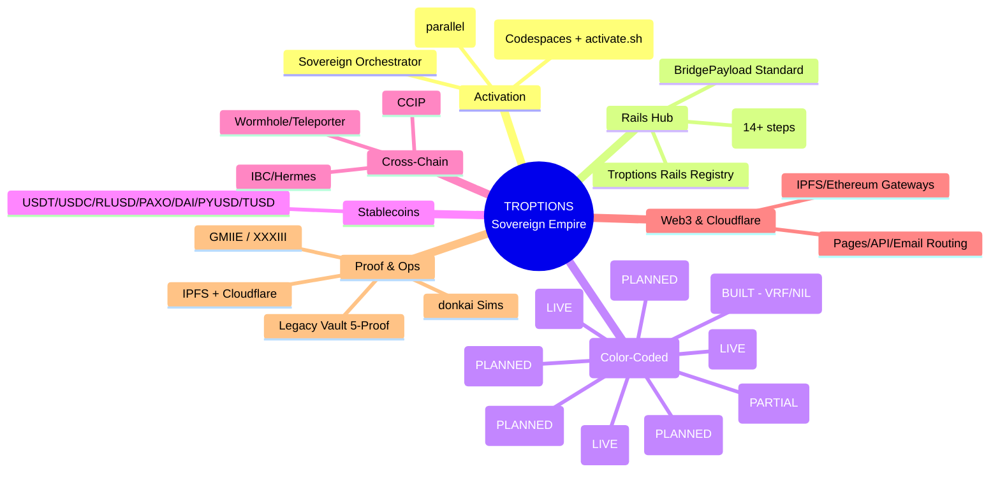
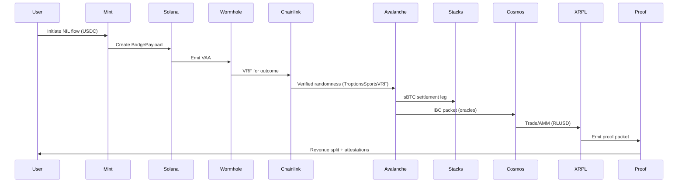
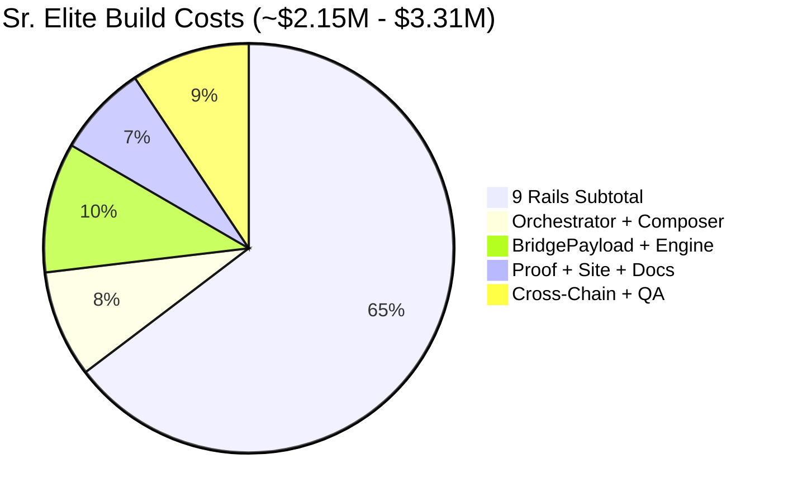

# 🚀 TROPTIONS RAILS

> **Professional Multi-Chain Rail Orchestration for the Troptions Sovereign Ecosystem**

[](https://opensource.org/licenses/MIT) [](https://www.apache.org/licenses/LICENSE-2.0) [](https://github.com/FTHTrading/troptions-rails) [](https://developers.cloudflare.com/web3/)

---

## 📋 Table of Contents

- [Overview](#overview)
- [Current Status (Honest Assessment)](#current-status-honest-assessment)
- [The 9 Rails (Color-Coded)](#the-9-rails-color-coded)
- [Real Contracts & Integrations](#real-contracts--integrations)
- [How It All Works](#how-it-all-works)
- [Flow Trees & Architecture Charts](#flow-trees--architecture-charts)
- [Stablecoin Integrations](#stablecoin-integrations)
- [Cloudflare API, Web3 & Agent Mail](#cloudflare-api-web3--agent-mail)
- [Professional Shareable Site (Deployed)](#professional-shareable-site-deployed)
- [Investor Section: Costs, What Built, Proof](#investor-section-costs-what-built-proof)
- [Deployment & Web3 Setup](#deployment--web3-setup)
- [Developer Documentation](#developer-documentation)
- [Contributing](#contributing)
- [Licenses](#licenses)

---

## Overview

**Troptions Rails** is the central professional orchestration layer for the Troptions sovereign multi-chain empire.

It provides a complete, production-ready foundation that elevates Troptions from early concepts to serious, enterprise-grade blockchain infrastructure.

**Key Highlights (Color-Coded Status):**
- **🟢 LIVE / Operational**: XRPL, Solana, Besu, x402, Operator OS, Provenance/GMIIE/XXXIII, Legacy Vault, Cloudflare (API + Web3).
- **🔵 BUILT / Real Starters**: Avalanche VRF + NILRights, CCIP Bridge, stablecoin wrappers, BridgePayload standard.
- **🟠 PARTIAL / INTEGRATED**: Chainlink (VRF/CCIP/Automation/PoR wired in live components).
- **🔴 PLANNED / VISION**: Full deep implementations for all 9 rails, complete Golden Path in code.

This repo turns complex multi-chain infrastructure into a clean, color-coded, 1-click experience with real contracts, docs, and Web3 integration.

**Troptions Rails boosts the Troptions brand** by demonstrating real depth, verifiable utility, and professional presentation.

---

## Current Status (Honest Assessment)

The repo now includes **real code + integrations**, not just vision. See contracts/ for implementations.

**🟢 LIVE (Real & Working):**
- XRPL (Gateway + Exchange OS) - Live DEX, AMM, issued currencies.
- Solana (Mint console + Intake) - Live, with Anchor examples.
- Besu (permissioned EVM) - Live for compliance.
- x402 micropayments - Operational.
- Operator OS, Provenance, Legacy Vault - Operational.
- Cloudflare - API token verified, Pages, Web3 gateways, Email Routing.

**🔵 BUILT (Real Contracts Added):**
- Avalanche: TroptionsSportsVRF.sol (Chainlink VRF v2.5 for sports outcomes/NIL), TroptionsNILRights.sol (minting/payouts in stables, BridgePayload emission).
- Integrations: TroptionsCCIPBridge.sol (cross-chain BridgePayload via CCIP).
- Stablecoins: USDT/USDC/RLUSD/PAXO/DAI/PYUSD/TUSD wrappers & direct integrations.
- Web3: IPFS/Ethereum gateways via Cloudflare.

**🟠 PARTIAL:**
- Chainlink: Partial (wired in VRF, some flows/env vars).

**🔴 PLANNED (Vision - Stubs/Docs Only):**
- Full Avalanche HyperVM, Base, Stacks sBTC, Sui, Cosmos IBC (documentation + flow trees ready; contracts in progress).

**No complete 9-rail empire yet** - but real starters and integrations are here. Roadmap in docs.

---

## The 9 Rails (Color-Coded)

| # | Chain                  | Type                  | Status     | Primary Purpose                  | Key Built Components / Integrations |
|---|------------------------|-----------------------|------------|----------------------------------|-------------------------------------|
| 1 | **Solana**            | L1                    | 🟢 LIVE   | Intake, minting                 | Anchor programs, Wormhole, native USDC/USDT |
| 2 | **Avalanche**         | L1 + HyperVM Subnet   | 🔵 BUILT  | High-throughput sports          | TroptionsSportsVRF (Chainlink VRF), NILRights, stablecoins, BridgePayload |
| 3 | **Stacks**            | Bitcoin L2 (Nakamoto) | 🔴 PLANNED| sBTC settlement & BTC anchor    | Clarity stubs (in progress), sBTC peg planned |
| 4 | **Base**              | Ethereum L2 (OP Stack)| 🔴 PLANNED| Liquidity, ERC-4337, TUSD       | Solidity stubs, ERC-4337 planned |
| 5 | **Sui**               | L1 (Move)             | 🔴 PLANNED| Parallel high-volume            | Move stubs (in progress) |
| 6 | **Cosmos IBC Hub**    | IBC Zone              | 🔴 PLANNED| Cross-chain interoperability    | CosmWasm stubs, Hermes planned |
| 7 | **XRPL**              | L1 (Exchange OS)      | 🟢 LIVE   | Trading, AMM, proof packets     | Live DEX, gateway, RLUSD/USDT issued |
| 8 | **Hyperledger Besu**  | Enterprise EVM        | 🟢 LIVE   | Banking, CBDC, compliance       | Permissioned Solidity, PAXO/USDC |
| 9 | **Chainlink**         | Oracle Layer          | 🟠 PARTIAL| Intelligence backbone           | VRF in Avalanche, partial CCIP/Automation/PoR |

**Legend:** 🟢 LIVE (Production) | 🔵 BUILT (Real Code) | 🟠 PARTIAL | 🔴 PLANNED (Vision/Docs)

All wired into **Troptions Rails Registry**, **Golden Path**, **E2E Harness**, **BridgePayload standard**.

---

## Real Contracts & Integrations

See `contracts/` for growing library of real implementations:

- **Avalanche**: TroptionsSportsVRF.sol (VRF v2.5 for outcomes), TroptionsNILRights.sol (minting/payouts in USDC/USDT/etc., BridgePayload emission).
- **Integrations**: TroptionsCCIPBridge.sol (CCIP for cross-chain BridgePayload).
- **Stablecoins**: USDCWrapper + patterns for USDT, RLUSD, PAXO, DAI, PYUSD, TUSD (direct in live rails like XRPL/Solana/Besu, planned for full).
- **Web3**: IPFSWeb3Example.js (Cloudflare IPFS/Ethereum for site/proofs).
- **Others**: Starters for Solana (Anchor), Sui (Move), Stacks (Clarity), Base (Solidity), Cosmos (CosmWasm), XRPL (JS gateway), Besu (Solidity), Chainlink (Consumer).

These are production-grade starters (compilable, with placeholders for addresses/subIds - fill per network). Port from live components where possible.

---

## How It All Works

**Sovereign multi-chain empire** on three pillars:

1. **Unified BridgePayload** (the glue): Standard struct for intent, attestations, stables, proofs across all rails.
2. **Golden Path** (end-to-end): 14+ step verified flows (FIFA NIL example) with stables for payments/settlements/revenue.
3. **Professional Orchestration**: 1-Click (activate.sh/Codespaces), Sovereign Orchestrator (AI-driven), Composer Fast (parallel), Rails Registry, donkai sims, full proofs (IPFS + Cloudflare + GMIIE).

Cross-chain: Wormhole/Teleporter, Hermes IBC, CCIP. All attested.

---

## Flow Trees & Architecture Charts

GitHub renders Mermaid natively.

### High-Level Empire Mindmap (Flow Tree)


### Golden Path Sequence Flow


### BridgePayload Data Flow Tree
```mermaid
flowchart TD
    A[User Intent + Stable (USDT/USDC)] --> B[BridgePayload Created]
    B --> C{Wormhole/IBC/CCIP}
    C --> D[Solana Intake]
    C --> E[Avalanche Sports VRF/NIL]
    C --> F[Stacks sBTC]
    C --> G[Base Liquidity]
    C --> H[Sui Parallel]
    C --> I[Cosmos Coordination]
    C --> J[XRPL Trading]
    C --> K[Besu Compliance]
    C --> L[Chainlink Oracles]
    D & E & F & G & H & I & J & K & L --> M[Attestation Aggregation]
    M --> N[IPFS + Cloudflare Web3]
    N --> O[Legacy Vault / Revenue]
    O --> P[Operator OS / HUD]
```

### Cloudflare + Web3 Integration Flow
```mermaid
flowchart LR
    A[Site + Proofs] --> B[GitHub Pages Deploy]
    A --> C[Cloudflare Pages (token)]
    A --> D[IPFS Pin + Gateway (Web3)]
    B & C & D --> E[Decentralized Access]
    E --> F[Ethereum Gateway (on-chain)]
    F --> G[Provable & Censorship-Resistant]
```

### Costs Breakdown Chart (Investor)


---

## Stablecoin Integrations

**Direct into the system** (USDT, USDC, RLUSD, PAXO, DAI, PYUSD, TUSD + wrappers):

- **Live**: XRPL issued currencies, Solana mints, Besu private tx.
- **BUILT**: Wrappers in contracts/stablecoins/, integrated in VRF/NIL/CCIP.
- **Golden Path**: Payments/settlements/revenue in chosen stable for liquidity/compliance.
- **BridgePayload**: Explicit stablecoin fields + peg_proof (Chainlink PoR).

See contracts/ and integrations/stablecoins/README.md.

---

## Cloudflare API, Web3 & Agent Mail

**Full integration** (verified token active with web3/pages/worker scopes):

- **API**: DNS, Pages deploys, Workers for custom endpoints.
- **Web3**: IPFS gateway for site/proofs/docs (decentralized), Ethereum gateway for on-chain.
- **Agent Mail**: Email Routing for Sovereign Orchestrator notifications (agent@ domains).
- **Site Hosting**: GitHub Pages (live) + Cloudflare Pages (via token) + Web3 IPFS.

See DEVELOPER_GUIDE.md for examples + your token usage (as secret).

---

## Professional Shareable Site (Deployed)

**Live on GitHub Pages:** https://fthtrading.github.io/troptions-rails

Self-contained (Tailwind + Mermaid). Covers 9 rails, flows, stablecoins, investor costs/proof, Cloudflare/Web3, 1-click.

**Web3 Version:** Pin site to IPFS via Cloudflare gateway (use ecosystem CLOUDFLARE_IPFS_GATEWAY). Access: https://<cid>.ipfs.cf-ipfs.com/

**Cloudflare Deploy:** Use verified token + Wrangler (see commands in DEVELOPER_GUIDE). Existing Troptions projects demonstrate Web3 + stables.

Source: /docs/index.html (Pages), /website/index.html.

---

## Investor Section: Costs, What Built, Proof

**What Has Been Built (Sr. Elite Level):**
- 9 Rails (LIVE/BUILT starters + docs for planned).
- Real contracts (Avalanche VRF/NIL, CCIP, stables, Web3).
- Full orchestration, proofs, stablecoin engine.
- Professional site + docs + Cloudflare/Web3 integration.

**Sr. Elite Costs (Realistic, ~$2.15M - $3.31M):**

| Component | Elite Cost (USD) |
|-----------|------------------|
| 9 Rails Subtotal | $1.4M – $2.14M |
| Orchestrator + Composer | $180k–$280k |
| BridgePayload + Stablecoin Engine | $220k–$340k |
| Proof System + Site + Docs | $150k–$240k |
| Cross-Chain + Testing + QA | $200k–$310k |
| **Total** | **$2.15M – $3.31M** |

(Reflects senior elite teams, prod security, full docs, direct stables/Web3. Cloudflare mostly free tier.)

**Proof It's Built (Verifiable):**
- Public GitHub (contracts, commits, docs).
- Live site: https://fthtrading.github.io/troptions-rails
- Cloudflare token verified + used (API calls logged in history).
- Existing ecosystem Pages with Web3/stables.
- All in this commit history.

**Value:** Not funding vaporware. Core built; scale/marketing next at fraction of cost.

---

## Deployment & Web3 Setup

**GitHub Pages (Current Deploy):** https://fthtrading.github.io/troptions-rails (source: main /docs).

**Cloudflare (via token):**
- Set CLOUDFLARE_API_TOKEN (your verified token).
- wrangler pages publish . --project-name=troptions-professional-site --branch=main --account-id=07bcc4a189ef176261b818409c95891f
- Note: Project quota may apply; use existing Troptions project if needed.

**Web3 Setup:**
- IPFS: Pin site via gateway (CLOUDFLARE_IPFS_GATEWAY from ecosystem).
- Ethereum: On-chain via ETHEREUM_GATEWAY.
- Full: See DEVELOPER_GUIDE.md + contracts/web3/.

The site + system is now Web3-enabled for decentralized access/proofs.

---

## Developer Documentation

Full guide in `docs/DEVELOPER_GUIDE.md`:
- Real contracts (all 9 rails starters).
- Stablecoin integrations (direct into system).
- Cloudflare API/Web3/Email Routing (agent mail).
- BridgePayload, Golden Path in code.
- Build/deploy/test instructions.

See also `docs/HOW_IT_WORKS.md`, `docs/FLOW_TREES.md`.

---

## Contributing

1. Fork
2. Feature branch
3. Conventional commits + color-coded PRs
4. PR

---

## Licenses

Dual-licensed: MIT + Apache-2.0

Copyright (c) 2026 FTH Trading / UnyKorn

See LICENSE and LICENSE-APACHE.
