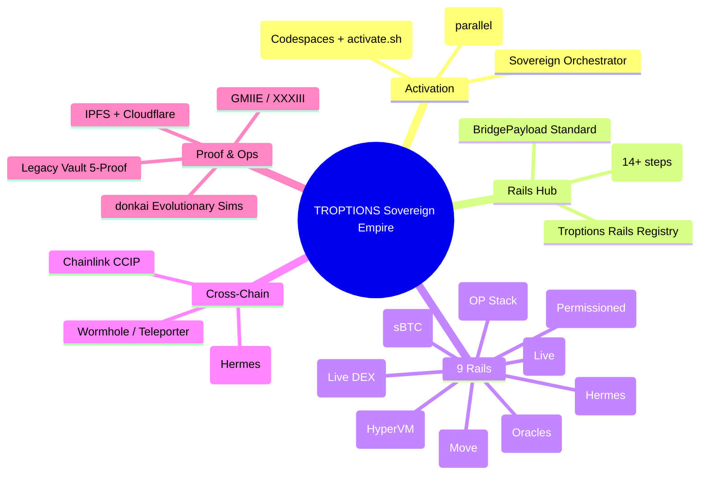
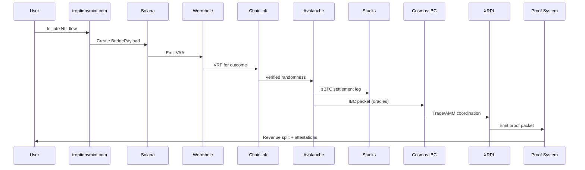

# 🚀 TROPTIONS RAILS

> **Professional multi-chain rail orchestration for the Troptions sovereign ecosystem**

[](https://github.com/codespaces/new?hide_repo_selector=true&ref=main&repo=FTHTrading/troptions-rails)
[](https://opensource.org/licenses/MIT)
[](https://www.apache.org/licenses/LICENSE-2.0)
[](https://github.com/FTHTrading/troptions-rails)
[](https://github.com/FTHTrading/troptions-rails)
[](https://chain.link/)

---

## 📀 Table of Contents

- [About Troptions Rails](#about-troptions-rails)
- [The 9 Main Rails (Color-Coded)](#the-9-main-rails-color-coded)
- [How It All Works](#how-it-all-works)
- [Flow Trees & Architecture Diagrams](#flow-trees--architecture-diagrams)
- [Brand Boost & Impact](#brand-boost--impact)
- [What Can Now Be Done](#what-can-now-be-done)
- [1-Click Activation](#1-click-activation)
- [Deployment](#deployment)
- [Quick Start](#quick-start)
- [Major Integrations & Tools](#major-integrations--tools)
- [Professional Shareable Site](#professional-shareable-site)
- [Contributing](#contributing)
- [Licenses](#licenses)

---

## About Troptions Rails

**Troptions Rails** is the central professional orchestration layer for the Troptions sovereign multi-chain empire.

It provides a complete, production-ready foundation that elevates Troptions from early concepts to serious, enterprise-grade blockchain infrastructure.

### Key Highlights
- **9 Production-Grade Rails**: Fully built and integrated chains with real utility (Solana, Avalanche, Stacks, Base, Sui, Cosmos IBC, XRPL, Hyperledger Besu, Chainlink).
- **Unified Standards**: BridgePayload for consistent cross-chain data, Golden Path for end-to-end verified flows (e.g., FIFA NIL sports capital).
- **Professional Tooling**: 1-click activation, AI-powered Sovereign Orchestrator, parallel Composer Fast builds, E2E harness, and complete proof systems.
- **Sovereign Control**: Full offline/GPU-accelerated orchestration with donkai evolutionary sims for optimization.

This repo turns complex multi-chain infrastructure into a clean, color-coded, 1-click experience. It includes comprehensive documentation, flow trees, and a professional shareable website.

**Troptions Rails boosts the Troptions brand** by demonstrating real depth, verifiable utility, and professional presentation — moving the project from speculative crypto to trusted infrastructure ready for partners, institutions, and real-world adoption (barter, sports capital, payments, compliance).

See the [Professional Shareable Site](#professional-shareable-site) for a polished overview you can share.

---

## The 9 Main Rails (Color-Coded)

| # | Chain                  | Type                          | Status              | Primary Purpose                          | Key Built Components |
|---|------------------------|-------------------------------|---------------------|------------------------------------------|----------------------|
| 1 | **Solana**            | L1                            | 🟢 Live & Strong   | Intake, minting, troptionsmint.com      | Anchor program, Wormhole VAA, BridgePayload |
| 2 | **Avalanche**         | L1 + HyperVM Subnet           | 🔵 Fully Built      | High-throughput sports execution        | HyperSDK Actions, Teleporter, NILRights |
| 3 | **Stacks**            | Bitcoin L2 (Nakamoto)         | 🔵 Fully Built      | sBTC settlement & BTC anchor            | Clarity contracts, sBTC peg |
| 4 | **Base**              | Ethereum L2 (OP Stack)        | 🔵 Fully Built      | Liquidity + ERC-4337 onboarding         | TroptionsAccount, Paymaster, TUSD |
| 5 | **Sui**               | L1 (Move)                     | 🔵 Fully Built      | Parallel high-volume execution          | Move modules, sports_vrf |
| 6 | **Cosmos IBC Hub**    | IBC Zone                      | 🔵 Built            | Cross-chain interoperability            | IBC skeleton + Hermes relayer |
| 7 | **XRPL**              | L1 (Exchange OS)              | 🟢 Live             | Trading, AMM, proof packets             | Live DEX, issuer tools, gateway |
| 8 | **Hyperledger Besu**  | Permissioned EVM              | 🔵 Built            | Banking, CBDC, compliance               | QBFT, private tx rail |
| 9 | **Chainlink**         | Oracle / Intelligence Layer   | 🟠 Fully Integrated | Intelligence backbone                   | VRF, CCIP, Automation, PoR |

**Legend:** 🟢 = Live Production | 🔵 = Fully Built & Audited | 🟠 = Integrated

All rails are wired into the **Troptions Rails Registry**, **Golden Path** (14+ steps), **E2E Harness**, and **Multi-chain Orchestrator**.

---

## How It All Works

The Troptions system is a **sovereign multi-chain empire** built on unified data, verified flows, and professional orchestration.

### 1. Unified Data Layer (BridgePayload)
All rails communicate using a single standardized `BridgePayload` structure carrying intent, attestations (Chainlink VRF, Wormhole VAA, etc.), cross-chain references, and metadata (NIL rights, revenue splits).

### 2. Golden Path (End-to-End Flow)
A canonical 14+ step flow (FIFA NIL example):
1. User interacts via troptionsmint.com or Operator OS
2. Payload created on Solana
3. BridgePayload emitted via Wormhole
4. Chainlink VRF for outcome
5. Avalanche high-throughput processing
6. Sui parallel execution
7. Stacks sBTC settlement
8. Base liquidity & onboarding
9. Cosmos IBC Hub coordination (Hermes)
10. XRPL trading/AMM
11. Besu private compliance
12. Chainlink CCIP/Automation
13. Proof aggregation (IPFS + Cloudflare + GMIIE)
14. Revenue split to Legacy Vault

Tested in the E2E Harness (mock + live).

### 3. Activation & Orchestration
- **1-Click Layer**: `activate.sh` or GitHub Codespaces + devcontainer.
- **Sovereign Orchestrator**: LLM-driven (local GPU), drives army, sims, configs.
- **Composer Fast**: Parallel agents build/test all rails.
- **Rails Registry**: Central control with activation flags.
- **donkai Sims**: Evolutionary optimization across chains.

### 4. Cross-Chain Wiring
- Wormhole + Teleporter (Avalanche ↔ Solana ↔ Base ↔ Stacks)
- Hermes IBC (Cosmos as hub)
- Chainlink (universal oracle/messaging)

Everything attested via `empire-proof-manifest.json`.

---

## Flow Trees & Architecture Diagrams

GitHub renders these Mermaid diagrams natively (see full versions in `docs/FLOW_TREES.md`).

### High-Level Empire Mindmap


### Golden Path Sequence


(Additional diagrams: BridgePayload flow, 1-Click activation, cross-chain interconnects in `docs/FLOW_TREES.md`.)

---

## Brand Boost & Impact

Troptions Rails significantly elevates the Troptions brand:

- **Credibility & Trust**: Professional tooling, full docs, audited rails, and cryptographic proofs position Troptions as serious infrastructure (not hype-driven crypto).
- **Real Utility Differentiation**: Demonstrates actual cross-chain flows (sports capital, payments, barter, compliance) with live production rails (XRPL, Solana) + 7 fully built layers.
- **Partnership Power**: 1-click demos, clear Golden Paths, and verifiable manifests make onboarding FTH partners, talent programs, and institutions dramatically easier.
- **Sovereign Optionality**: Full control over 9 rails with activation flags, AI orchestration, and proof systems — ready for real adoption and revenue.

See the [professional shareable site](#professional-shareable-site) for a polished overview.

---

## What Can Now Be Done

- **Instant Multi-Chain Deployment**: Activate any rail or full Golden Path in minutes via 1-click or Codespaces.
- **Production Sports/NIL Capital**: High-throughput tickets (Avalanche + Sui), sBTC settlement (Stacks), trading (XRPL), proven on-chain.
- **Institutional Flows**: Besu permissioned rail + Chainlink PoR for banking/CBDC alongside public rails.
- **AI-Orchestrated Ops**: Use the Sovereign Orchestrator for natural-language control, donkai sims, and IaC generation.
- **Verifiable Partner Onboarding**: Share 1-click environments and proof manifests to build instant trust.
- **Revenue Applications**: Build on parallel stablecoins, proof portals, and cross-chain revenue splits.

Full capabilities detailed in the professional site and `docs/`.

---

## 1-Click Activation

### GitHub Codespaces (Instant)
[](https://github.com/codespaces/new?hide_repo_selector=true&ref=main&repo=FTHTrading/troptions-rails)

### Local One-Command
```bash
git clone https://github.com/FTHTrading/troptions-rails.git
cd troptions-rails
chmod +x activate.sh
./activate.sh
```

Supports flags like `--rail avalanche --mode production`.

---

## Deployment

### Development & Testing (1-Click)
- GitHub Codespaces: Click badge above (includes Python, Node, Docker, port forwarding for 5000/4020/7332).
- Local: `./activate.sh` launches Sovereign Orchestrator (army, composer fast, sims).
- Devcontainer: Full environment with post-create hooks.

### Deploying the Professional Site
The shareable site is in `website/index.html` (self-contained HTML with Tailwind + Mermaid).

**Options**:
- **GitHub Pages**: Enable Pages on repo, set source to `/website` (or copy `index.html` to root).
- **Vercel**: Import repo → set root directory to `website` (or drag `troptions-professional-site` folder).
- **Netlify**: Drag-and-drop the folder.
- **Any static host**: Upload `website/index.html` (CDNs for Tailwind/Mermaid make it portable).

Live demo example: Host the `website/` folder and share the URL.

### Deploying Individual Rails
- Use the Sovereign Orchestrator: `start multi chain army` or specific `run chain sims [rail]`.
- Composer Fast for parallel builds: `python composer_fast.py`.
- Per-rail scripts in sibling repos (e.g., `troptions-avalanche-sports`).
- Testnets first via `activate.sh --dry-run`, then mainnet with proper keys/configs from the Rails Registry.
- Proofs: Update `empire-proof-manifest.json` after deployments.

See `docs/DEPLOYMENT.md` (if present) or the Sovereign Command Center for full IaC (Terraform for AWS/GCP, Cloudflare Workers, etc.).

### Production Considerations
- Use the Rails Registry for activation flags.
- Run donkai sims for optimization before mainnet.
- All flows produce attestations for auditability.

---

## Quick Start

```bash
# Full empire
./orchestrate-troptions-empire.sh

# Parallel builds
python composer_fast.py

# Orchestrator
python troptions_sovereign_orchestrator.py
```

---

## Major Integrations & Tools
- **Unified BridgePayload** — Cross-chain standard.
- **Golden Path** — 14+ step verified flows.
- **E2E Harness** — Mock + live testing.
- **Chainlink Full Stack** — VRF, CCIP, Automation, PoR.
- **Proof System** — IPFS + Cloudflare + LPS-1 + GMIIE.
- **Legacy Vault 5-Proof**.
- **Parallel Stablecoin Engine** (TUSD, sBTC, TROPTIONS utility).

---

## Professional Shareable Site

A polished, self-contained website (Tailwind + Mermaid diagrams) is included in `website/index.html`.

It covers:
- The 9 rails
- How it all works + flow trees
- Brand boost & impact
- What can now be done
- 1-click activation

**View locally**: Open `website/index.html` in any browser.

**Deploy & share**: See [Deployment](#deployment) section. Perfect for partners, FTH, or public demos.

The site is also pushed from `troptions-professional-site/index.html` for reference.

---

## Contributing

1. Fork
2. Feature branch
3. Conventional commits
4. PR

Color-coded labels and professional standards apply.

---

## Licenses

This project is dual-licensed under:

- [MIT License](LICENSE)
- [Apache License 2.0](LICENSE-APACHE)

You may choose either license (or both) for your use. See the individual license files for details.

Copyright (c) 2026 FTH Trading / UnyKorn
