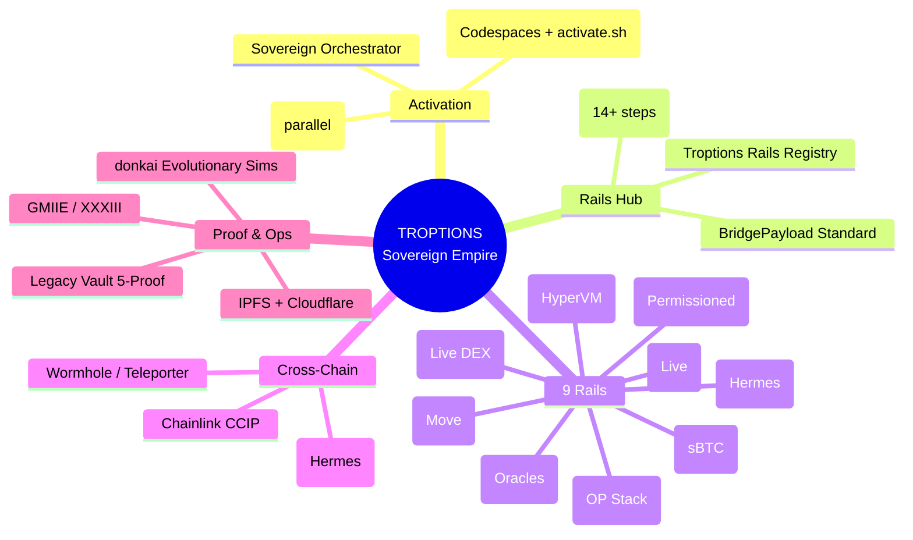
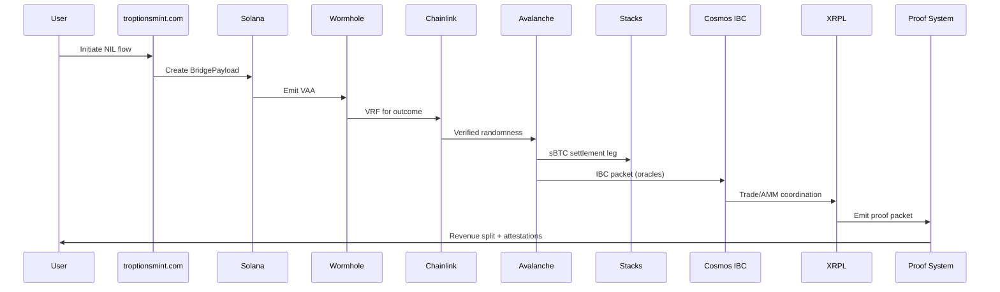
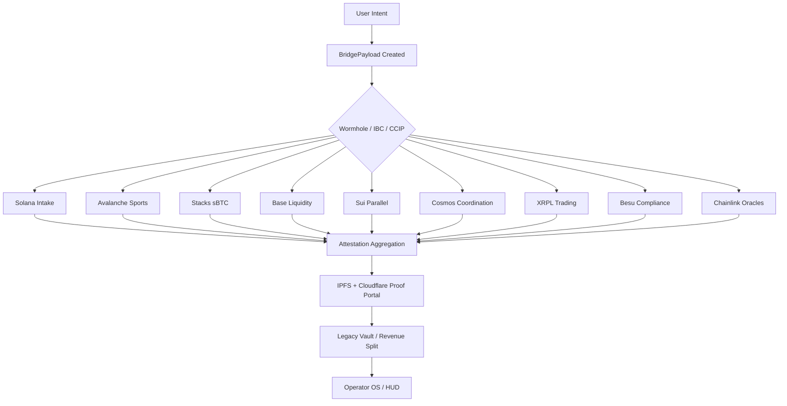
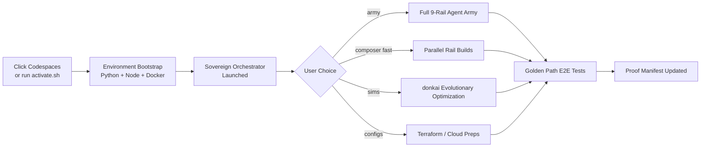
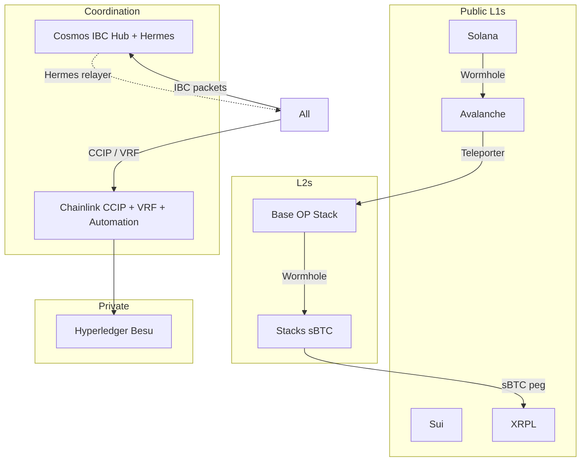

# Flow Trees & Architecture Diagrams

All diagrams are written in Mermaid (natively rendered by GitHub).

## 1. High-Level Empire Mindmap (Flow Tree)

## 2. Golden Path Sequence Diagram

## 3. BridgePayload Data Flow Tree

## 4. 1-Click Activation Flow

## 5. Cross-Chain Interconnect Tree

## How to Extend These Diagrams

Edit the Mermaid blocks in this file or the README. GitHub will re-render them automatically on commit.

For static images, you can export from the Mermaid Live Editor and commit the PNG/SVG alongside the .md.